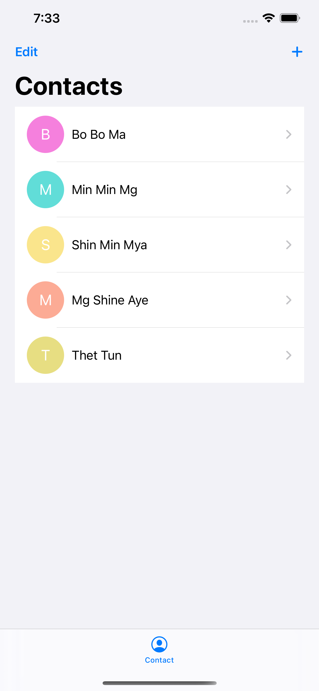
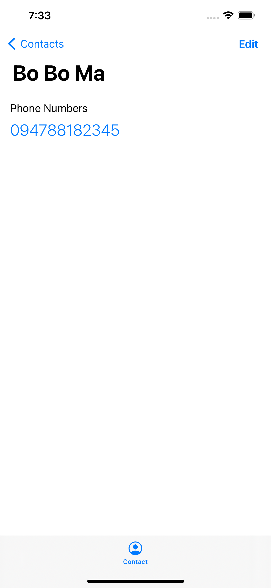
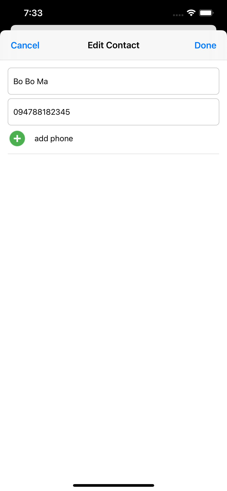

# Contact App

Basic App Using CoreData | Realm

<ul>
    <li><a href="https://github.com/thethtun/contact-core-data/tree/feature/refactor-swiftui"> 
Refactor With SwiftUI
</li>
    <li><a href="https://github.com/thethtun/contact-core-data/tree/feature/migrate-to-realm"> 
Using Realm
</li>
</ul>

  
  
  

